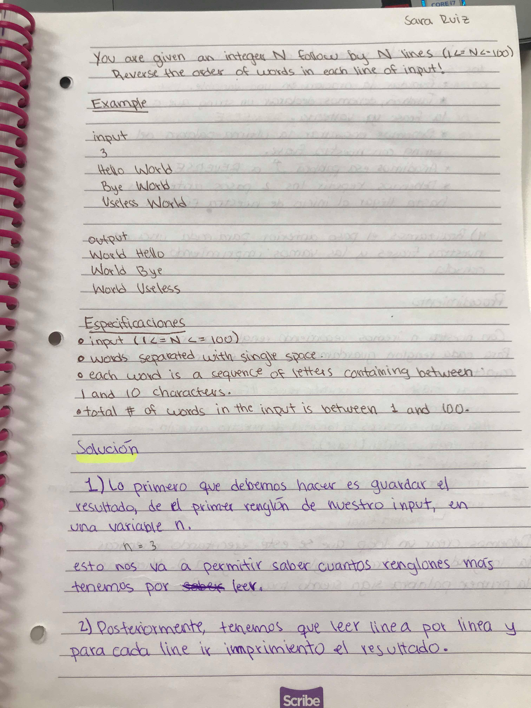
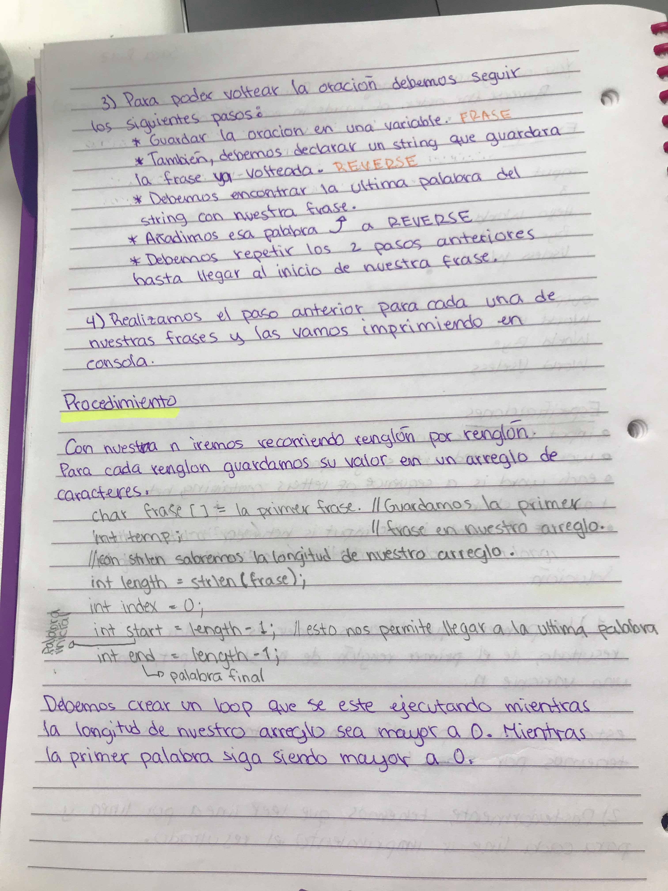
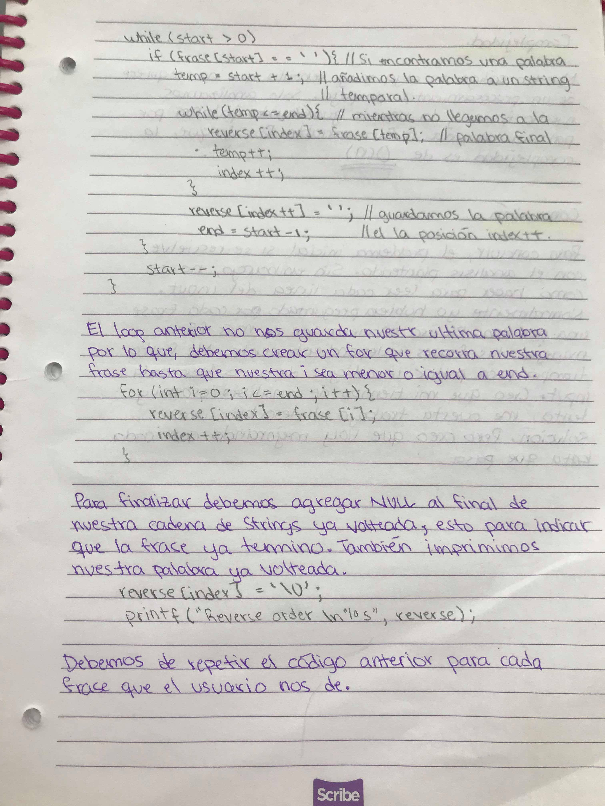
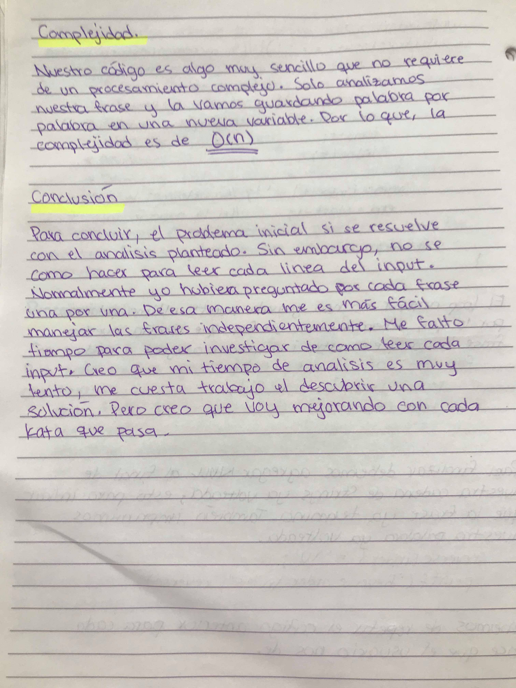

EXAMEN PARCIAL 2

You are given an integer N, followed by N lines of input (1 <= N <= 100). Each line of input contains one or several words separated with single spaces. Each word is a sequence of letters of English alphabet containing between 1 and 10 characters, inclusive. The total number of words in the input is between 1 and 100, inclusive.

Your task is to reverse the order of words in each line of input, while preserving the words themselves. The lines of your output should not have any trailing or leading spaces.

Example

input
3
Hello World
Bye World
Useless World

output
World Hello
World Bye
World Useless

Imagenes del analisis

