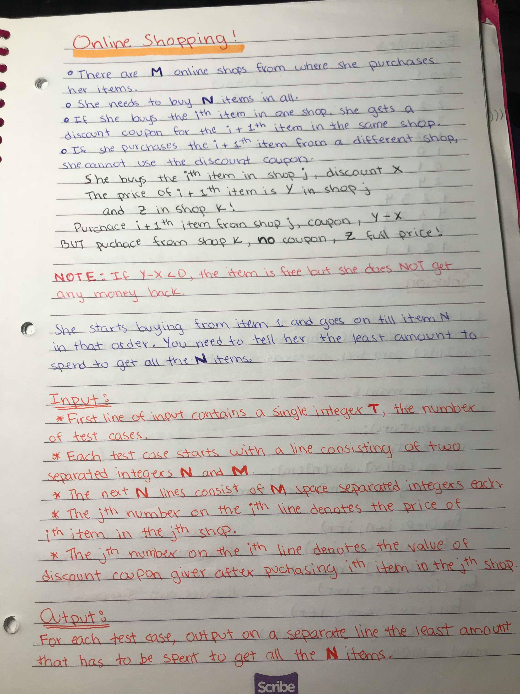
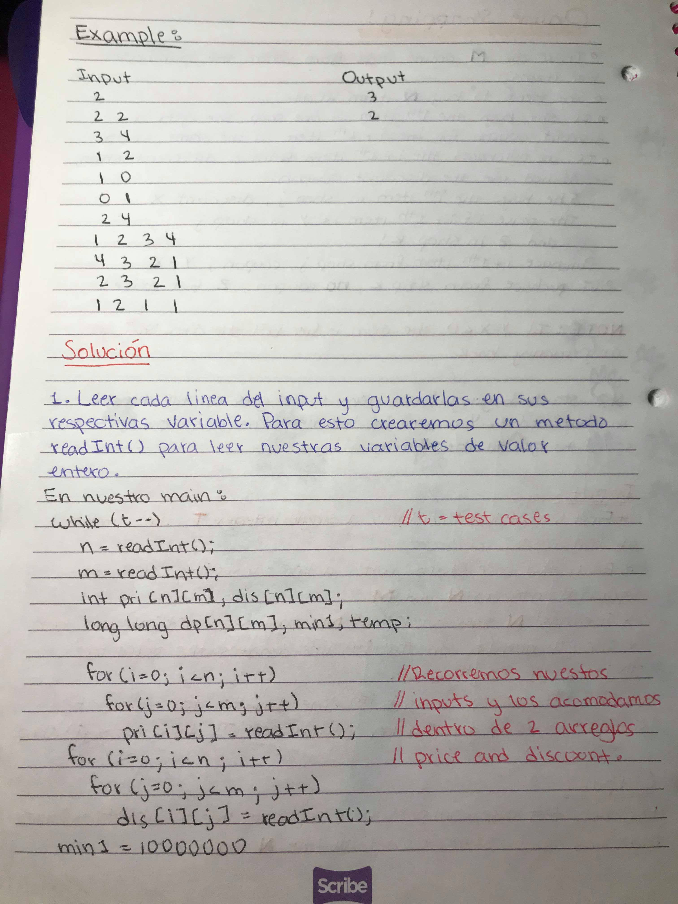
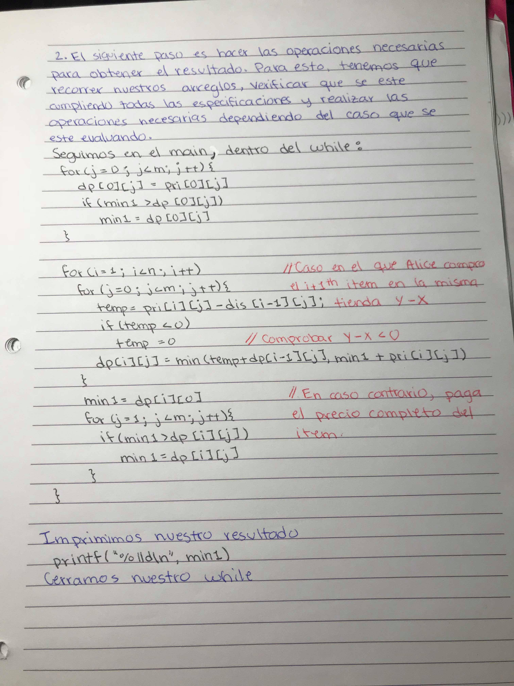

Problem: Online Shopping

Alice likes to shop online. The main reason is that she gets a lot of discounts! There are M online shops from where she purchases her items. The prices of the same item vary in both the shops. She needs to buy N items in all. And each she can buy each item in any one of the shops. All the shops offer certain discounts. If she buys the ith item in one shop, she gets a discount coupon for the i+1th item in the same shop. But if she purchases the i+1th item from a different shop, she cannot use the discount coupon.
For example, if she buys the ith item in Shop j and gets a discount of X rupees. Let the price of i+1th item be Y rupees in shop j and Z rupees in shop k. If she purchases the i+1th item from shop j she can use the discount coupon and hence, will have to pay Y-X rupees. If she purchases the i+1th item from shop k she cannot use the discount coupon and hence, will have to pay Z rupees.

Note: If the discount given is more than price of the item in the shop, i.e. if Y-X < 0, the item is given free but she does NOT get any money back.

Alice wants to spend as less as possible and wants your help. She starts buying from item 1 and goes on till item N in that order. Your task is simple. Tell her the least amount to spend to get all the N items.

Input:
First line of input contains a single integer T, the number of test cases.

Each test case starts with a line consisting of two space separated integers N & M.
The next N lines consist of M space separated integers each. The jth number on the ith line denotes the price of ith item in the jth shop.

The next N lines consist of M space separated integers each. The jth number on the ith line denotes the value of discount coupon given after purchasing ith item in the jth shop.

Output:
For each test case, output on a separate line the least amount that has to be spent to get all the N items.

