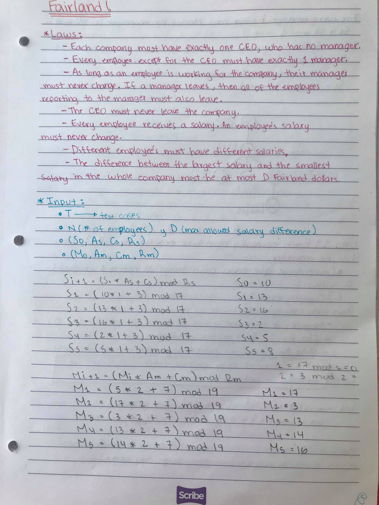
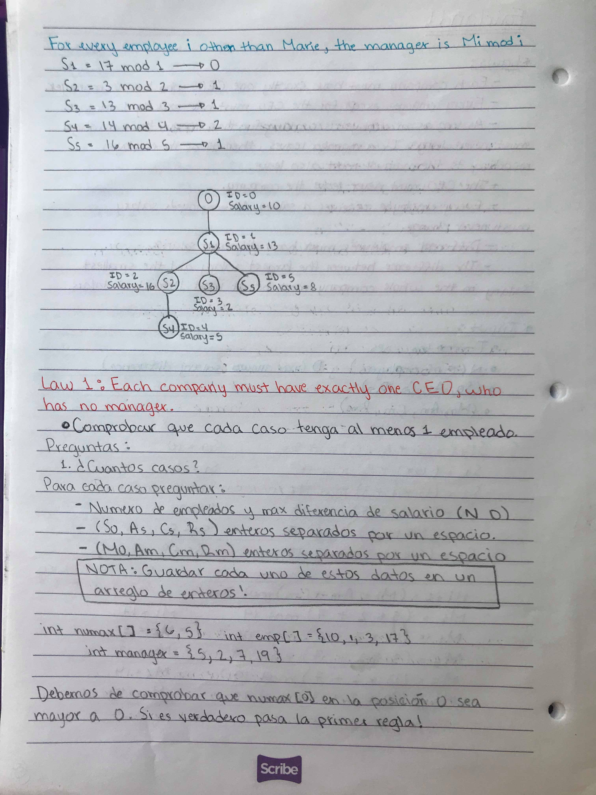
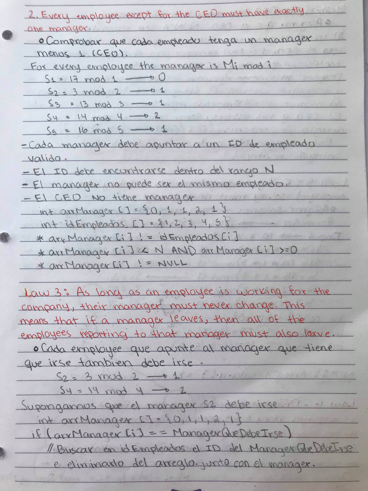
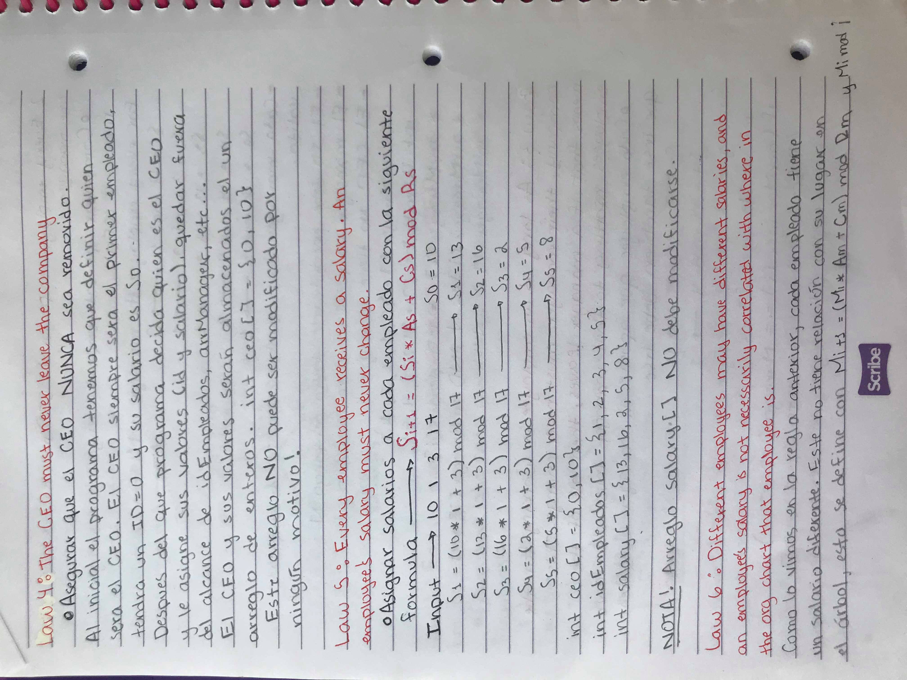
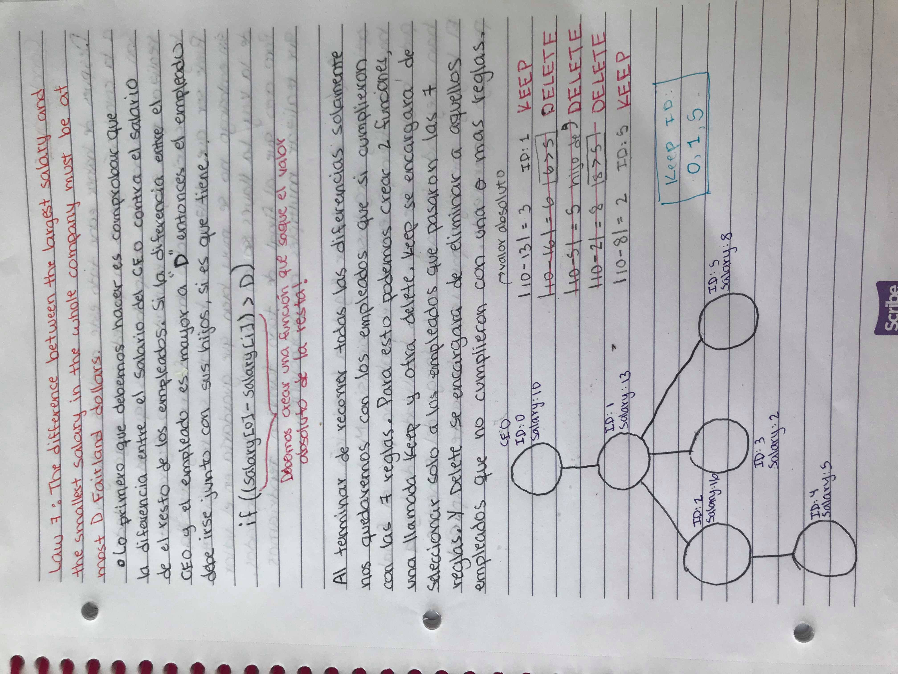
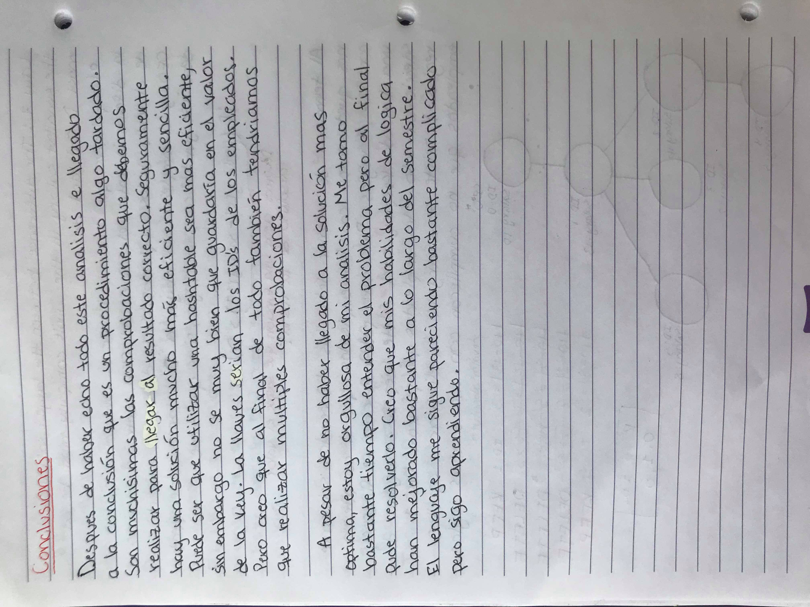

FAIRLAND

Problem
The country of Fairland has very strict laws governing how companies organize and pay their employees:
  - Each company must have exactly one CEO, who has no manager.
  - Every employee except for the CEO must have exactly one manager. (This means that the org chart showing all of the employees in a company is a tree, without cycles.)
  - As long as an employee is working for the company, their manager must never change. This means that if a manager leaves, then all of the employees reporting to that manager must also leave.
  - The CEO must never leave the company.
  - Every employee receives a salary -- some amount of Fairland dollars per year. An employee's salary must never change.
  - Different employees may have different salaries, and an employee's salary is not necessarily correlated with where in the org chart that employee is.

The government of Fairland has just passed one additional law:
  - The difference between the largest salary and the smallest salary in the whole company must be at most D Fairland dollars.

Marie is the CEO of the Fairland General Stuff Corporation, and she has to ensure that her company complies with the new law. This may require laying off some employees. She has the list of the company's employees, their managers, and their salaries. What is the largest number of employees she can keep, including herself?

Input
The first line of the input gives the number of test cases, T. T test cases follow. Each case begins with one line containing two space-separated integers N (the number of employees) and D (the maximum allowed salary difference). This is followed by one line with four space-separated integers (S0, As, Cs, Rs) and then another line with four more space-separated integers (M0, Am, Cm and Rm). These last eight integers define the following sequences:

Si+1 = (Si * As + Cs) mod Rs
Mi+1 = (Mi * Am + Cm) mod Rm

Marie's employee ID is 0, and all other employees have IDs from 1 to N - 1, inclusive. The salary of employee i is Si. For every employee i other than Marie, the manager is Mi mod i. (Note that this means that M0 does not affect Marie's manager -- she has none!)

Output
For each test case, output one line containing "Case #x: y", where x is the test case number (starting from 1) and y is the largest number of employees Marie can keep at the company, including herself, such that all of laws 1-7 are obeyed.

Limits
1 ≤ T ≤ 100.
0 ≤ S0 < Rs.
0 ≤ M0 < Rm.
0 ≤ As, Am ≤ 1000.
0 ≤ Cs, Cm ≤ 109.
Small dataset
1 ≤ N ≤ 1000.
1 ≤ D ≤ 1000.
1 ≤ Rs, Rm ≤ 1000.
Large dataset
1 ≤ N ≤ 106.
1 ≤ D ≤ 106.
1 ≤ Rs, Rm ≤ 106.

Sample

Input
3
1 395
18 246 615815 60
73 228 14618 195
6 5
10 1 3 17
5 2 7 19
10 13
28 931 601463 36
231 539 556432 258

Output
Case #1: 1
Case #2: 3
Case #3: 5

In Case #1, the company has only a CEO and no other employees, but it does not violate any of the laws, so no changes need to be made.

In case #2 the optimal strategy is to save employees 0, 1, and 5 (who have salaries of 10, 13, and 8, respectively). It is not possible to save employee 2, for example, because her salary is more than 5 away from employee 0's salary of 10; since employee 0 cannot be laid off, employee 2 must be laid off (along with all employees who report to her).

If you want to check your sequences for employees 1 through 5, they are:

S: 13, 16, 2, 5, 8
M: 17, 3, 13, 14, 16
Manager numbers: 17 % 1 = 0, 3 % 2 = 1, 13 % 3 = 1, 14 % 4 = 2, 16 % 5 = 1

IMAGENES

